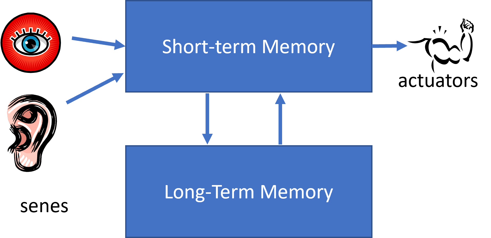
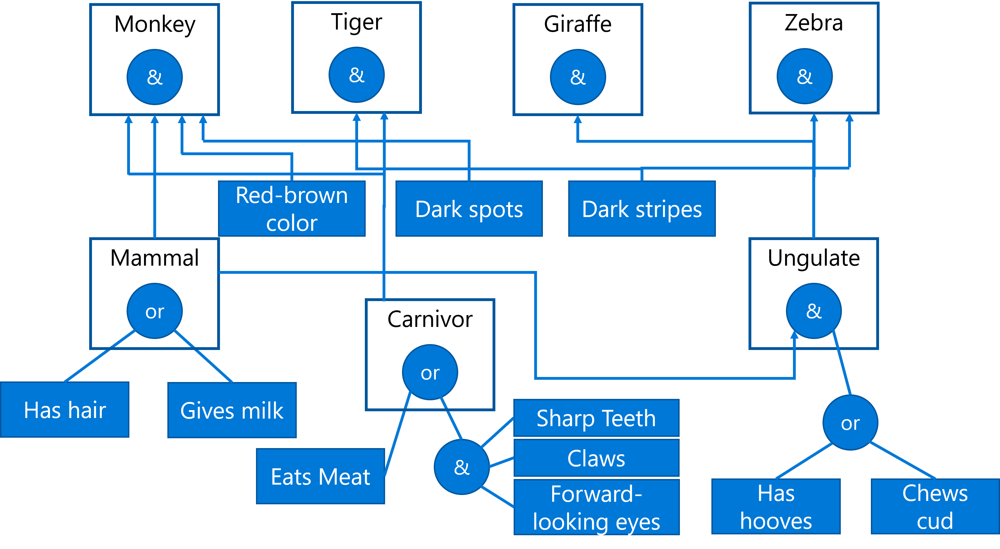

# 知识表示和专家系统


> Sketchnote by [Tomomi Imura](https://twitter.com/girlie_mac)

对人工智能的追求基于对知识的探求，即像人类一样理解世界。但如何才能做到这一点呢？

## [课前测验](https://red-field-0a6ddfd03.1.azurestaticapps.net/quiz/102)

在人工智能的早期，自上而下创建智能系统的方法（在上一课中讨论过）很流行。当时的想法是从人身上提取知识，转化为机器可读的形式，然后利用这些知识自动解决问题。这种方法基于两大理念：

* 知识表示
* 推理

## 知识表示

符号人工智能的一个重要概念是**知识**。必须将知识与*信息*或*数据*区分开来。例如，我们可以说书籍包含知识，因为人们可以通过学习书籍成为专家。然而，书籍所包含的内容实际上被称为*数据*，通过阅读书籍并将这些数据整合到我们的世界模型中，我们就将这些数据转换成了知识。

> ✅ **知识**是包含在我们头脑中的东西，代表了我们对世界的理解。它是通过一个主动的**学习**过程获得的，这个过程将我们接收到的信息碎片整合到我们的主动世界模型中。

大多数情况下，我们并不严格定义知识，而是使用[DIKW 金字塔](https://en.wikipedia.org/wiki/DIKW_pyramid)将知识与其他相关概念相联系。它包含以下概念：

** 数据**是用物理介质表示的东西，如书面文字或口头语言。数据独立于人类而存在，可以在人与人之间传递。
**信息**是我们如何在头脑中解释数据。例如，当我们听到 "计算机 "这个词时，就会对它有一定的理解。
**知识**是将信息整合到我们的世界模型中。例如，一旦我们知道了电脑是什么，我们就会开始对它的工作原理、价格以及用途有一些概念。这个相互关联的概念网络构成了我们的知识。
* 智慧**是我们理解世界的另一个层面，它代表了*元知识*，例如，关于如何以及何时使用这些知识的一些概念。


*Image [from Wikipedia](https://commons.wikimedia.org/w/index.php?curid=37705247), By Longlivetheux - Own work, CC BY-SA 4.0*

因此，**知识表示**的问题是找到某种有效的方法，在计算机内以数据的形式表示知识，使其自动可用。这可以看作是一个范围：


> Image by [Dmitry Soshnikov](http://soshnikov.com)

* 在左侧，有几种非常简单的知识表示法可以被计算机有效利用。最简单的是算法，即用计算机程序来表示知识。然而，这并不是表示知识的最佳方式，因为它不够灵活。我们头脑中的知识往往是非算法性的。
* 右边是自然文本等表征方式。它的功能最强大，但不能用于自动推理。

> ✅想一想，你是如何表述头脑中的知识并将其转换为笔记的？是否有一种特定的格式对你的记忆很有帮助？

## 计算机知识表示法的分类

我们可以将不同的计算机知识表示方法分为以下几类：

* 网络表示法**基于这样一个事实，即我们的头脑中有一个由相互关联的概念组成的网络。我们可以尝试在计算机中以图形的形式再现同样的网络--即所谓的**语义网络**。

1. **对象-属性-值三元组**或**属性-值对**。既然在计算机中可以用节点和边的列表来表示图，我们就可以用包含对象、属性和值的三元组列表来表示语义网络。例如，我们可以建立以下有关编程语言的三元组：

对象 | 属性 | 值
-------|-----------|------
Python | 是 | 无类型语言
Python | 的发明者 | 是Guido van Rossum
Python | 是块语法 | 缩进
无类型语言 | 没有 | 类型定义

> ✅ 思考如何用三元组表示其他类型的知识。

2. **分层表示法** 强调我们经常在头脑中创建一个对象的层次结构。例如，我们知道金丝雀是一种鸟，所有的鸟都有翅膀。我们还知道金丝雀通常是什么颜色，它们的飞行速度是多少。

   - 框架表示法**基于将每个对象或对象类别表示为一个包含**槽**的**框架。槽具有可能的默认值、值限制或可调用的存储过程，以获取槽的值。所有框架形成的层次结构类似于面向对象编程语言中的对象层次结构。
   - **情景**是一种特殊的框架，它表示可以在时间中展开的复杂情况。

## 译者注：下面表格原本打算翻译，但是效果不好。原文是用python语法的一些知识做例子，如果你懂python语法，相信看懂例子不是问题，如果你不懂语法，翻译了也看不懂。

**Python**

Slot  | Value | Default value | Interval |
-----|-------|---------------|----------|
Name | Python | | |
Is-A | Untyped-Language | | |
Variable Case | | CamelCase | |
Program Length | | | 5-5000 lines |
Block Syntax | Indent | | |

3. **程序化表示法**是通过一系列动作来表示知识的，这些动作在出现特定条件时可以执行。
   - 生产规则是允许我们得出结论的 "如果-那么 "语句。例如，医生可以制定一条规则，规定如果***病人发高烧***或***血液检测中的 C 反应蛋白水平较高，那么***他患有炎症。一旦遇到其中一种情况，我们就能对炎症做出结论，然后在进一步的推理中使用它。
   - 算法可以被视为另一种形式的程序表示法，尽管它们几乎从未直接用于基于知识的系统中。

4. **逻辑**最初是由亚里士多德提出的，用来表示人类的普遍知识。
   - 谓词逻辑作为一种数学理论，其内容过于丰富，无法计算，因此通常使用它的某些子集，如 Prolog 中使用的 Horn 子句。
   - 描述逻辑（Descriptive Logic）是逻辑系统的一个系列，用于表示和推理分布式知识表示（如语义网*）的对象层次。

## 专家系统

符号人工智能的早期成功之一是所谓的**专家系统**--计算机系统被设计为在某些有限的问题领域充当专家。它们基于从一个或多个人类专家那里提取的**知识库，并包含一个**推理引擎**，在此基础上进行推理。

 | 
---------------------------------------------|------------------------------------------------
人类神经系统的简化结构 | 基于知识的系统结构

专家系统的构造与人类的推理系统类似，都包含**短期记忆**和**长期记忆**。同样，在以知识为基础的系统中，我们将其分为以下几个部分：

** 问题记忆**：包含与当前要解决的问题有关的知识，如病人的体温或血压、是否有炎症等。这些知识也被称为**静态知识**，因为它包含了我们当前对问题了解的快照--即所谓的*问题状态*。
* 知识库**：代表有关问题领域的长期知识。它是从人类专家那里人工提取的，不会因咨询的不同而改变。由于它允许我们从一个问题状态浏览到另一个问题状态，因此也被称为**动态知识**。
* 推理引擎**：协调在问题状态空间中搜索的整个过程，必要时向用户提问。它还负责找到适用于每种状态的正确规则。

举例来说，让我们考虑下面这个根据动物的物理特征来判断动物的专家系统：



> Image by [Dmitry Soshnikov](http://soshnikov.com)

这种图被称为 **AND-OR 树**，是一组生产规则的图形表示。在从专家那里提取知识之初，绘制树形图非常有用。要在计算机中表示知识，使用规则更为方便：

```
如果动物吃肉
OR （动物有锋利的牙齿
    动物有爪子
    动物有向前看的眼睛
) 
则该动物是肉食动物
```

您可以注意到，规则左侧的每个条件和操作本质上都是对象-属性-值（OAV）三元组。**工作内存**包含与当前要解决的问题相对应的 OAV 三元组集合。**规则引擎**会查找满足条件的规则，并应用这些规则，将另一个三元组添加到工作内存中。

>✅ 就你喜欢的主题编写自己的 AND-OR 树！

### 前向推理与后向推理

上述过程称为**前向推理**。它以工作记忆中有关问题的一些初始数据为起点，然后执行以下推理循环：

1. 如果工作记忆中存在目标属性--停止并给出结果
2. 查找当前条件满足的所有规则--得到**冲突规则集**。
3. 执行**冲突解决**--选择一条将在本步骤中执行的规则。可能有不同的冲突解决策略：
   - 选择知识库中第一条适用的规则
   - 随机选择一条规则
   - 选择一条*具体*的规则，即满足 "左侧"（LHS）条件最多的规则
4. 应用选定的规则，在问题状态中插入新知识 5.
5. 重复步骤 1。

不过，在某些情况下，我们可能希望从有关问题的空白知识开始，提出有助于得出结论的问题。例如，在进行医学诊断时，我们通常不会在开始诊断病人之前提前进行所有医学分析。我们更希望在需要做出决定时进行分析。

这个过程可以用**后向推理**来建模。它由**目标**驱动，即我们希望找到的属性值：

1. 选择所有能给出目标值的规则（即目标在 RHS（"右侧"））--冲突集
1. 如果没有关于该属性的规则，或者有规则规定我们应该向用户询问该值--则询问该值，否则：
1. 使用冲突解决策略选择一条规则作为*假设*--我们将尝试证明它
1. 对规则左侧的所有属性重复上述过程，尝试将它们证明为目标
1. 如果该过程在任何时候失败，则在第 3 步使用另一条规则。

> ✅ 在哪些情况下，前向推理更合适？后向推理如何？

### 实施专家系统

专家系统可以用不同的工具来实现：

* 直接用高级编程语言编程。这不是最好的主意，因为基于知识的系统的主要优点是知识与推理分离，问题领域专家应该能够在不了解推理过程细节的情况下编写规则。
* 使用**专家系统外壳**，即专门为使用某种知识表示语言填充知识而设计的系统。

## ✍️ 练习： 动物推理

请参阅 [Animals.ipynb](https://github.com/microsoft/AI-For-Beginners/blob/main/lessons/2-Symbolic/Animals.ipynb)，了解实施前向和后向推理专家系统的示例。

> **注意**： 这个例子非常简单，只是提供了一个专家系统的概念。一旦你开始创建这样一个系统，只有当规则达到一定数量（大约 200 多条）时，你才会注意到它的一些*智能*行为。在某些时候，规则会变得过于复杂，以至于无法将所有规则都牢记在心，这时你可能会开始怀疑系统为什么会做出某些决定。不过，基于知识的系统的重要特点是，你总能*准确地解释*任何决定是如何做出的。

##本体论和语义网

20世纪末，有人倡议使用知识表示法来注释互联网资源，以便能够找到与非常具体的查询相对应的资源。这一倡议被称为**语义网**，它依赖于几个概念：

- 基于**[描述逻辑学](https://en.wikipedia.org/wiki/Description_logic)** (DL)的特殊知识表示法。它类似于框架知识表示法，因为它建立了一个具有属性的对象层次结构，但它具有正式的逻辑语义和推理。有一整套 DL，它们在表达能力和推理算法复杂性之间取得了平衡。
- 分布式知识表示法：所有概念都用一个全局 URI 标识符表示，这样就有可能创建跨越互联网的知识层次结构。
- 基于 XML 的知识描述语言系列： RDF（资源描述框架）、RDFS（RDF 模式）、OWL（本体网络语言）。

语义网的一个核心概念是**本体**。它指的是使用某种形式化的知识表示法对问题领域进行的明确规范。最简单的本体可能只是问题领域中对象的层次结构，但更复杂的本体将包括可用于推理的规则。

在语义网络中，所有表征都基于三元组。每个对象和每个关系都由 URI 唯一标识。例如，如果我们想说明本人工智能课程是由德米特里-索什尼科夫于 2022 年 1 月 1 日开发的，我们可以使用以下三元组：


```
http://github.com/microsoft/ai-for-beginners http://www.example.com/terms/creation-date “Jan 13, 2007”
http://github.com/microsoft/ai-for-beginners http://purl.org/dc/elements/1.1/creator http://soshnikov.com
```

> ✅ 这里的 `http://www.example.com/terms/creation-date` 和 `http://purl.org/dc/elements/1.1/creator` 是一些众所周知、被普遍接受的 URI，用来表达 * 创建者* 和 * 创建日期* 的概念。

更复杂的情况是，如果我们想定义创建者列表，可以使用 RDF 中定义的一些数据结构。


> Diagrams above by [Dmitry Soshnikov](http://soshnikov.com)

搜索引擎和自然语言处理技术可以从文本中提取结构化数据，它们的成功在某种程度上减缓了语义网的建设进度。不过，在某些领域，人们仍在为维护本体和知识库做出巨大努力。其中有几个项目值得一提：

* [WikiData](https://wikidata.org/)是与维基百科相关的机器可读知识库的集合。大部分数据都是从维基百科的*InfoBoxes*（维基百科页面内的结构化内容）中挖掘出来的。您可以使用SPARQL（一种用于语义网的特殊查询语言）对维基数据进行[查询](https://query.wikidata.org/)。下面是一个示例查询，显示人类最流行的眼睛颜色：

```sparql
#defaultView:BubbleChart
SELECT ?eyeColorLabel (COUNT(?human) AS ?count)
WHERE
{
  ?human wdt:P31 wd:Q5.       # human instance-of homo sapiens
  ?human wdt:P1340 ?eyeColor. # human eye-color ?eyeColor
  SERVICE wikibase:label { bd:serviceParam wikibase:language "en". }
}
GROUP BY ?eyeColorLabel
```

* [DBpedia](https://www.dbpedia.org/)是与 WikiData 类似的另一项工作。

> ✅ 如果你想尝试构建自己的本体或打开已有的本体，有一个很棒的可视化本体编辑器，名为[Protégé](https://protege.stanford.edu/)。下载或在线使用。


*Web Protégé editor open with the Romanov Family ontology. Screenshot by Dmitry Soshnikov*

## ✍️ 练习： 家庭本体论


有关使用语义网技术推理家庭关系的示例，请参阅[FamilyOntology.ipynb](https://github.com/Ezana135/AI-For-Beginners/blob/main/lessons/2-Symbolic/FamilyOntology.ipynb)。我们将采用以普通 GEDCOM 格式表示的家庭树和家庭关系本体，并为给定的个人集合构建一个包含所有家庭关系的图。

## 微软概念图

在大多数情况下，本体都是手工创建的。不过，从非结构化数据（如自然语言文本）中挖掘本体也是可能的。

微软研究院（Microsoft Research）就做过这样的尝试，并产生了[微软概念图](https://blogs.microsoft.com/ai/microsoft-researchers-release-graph-that-helps-machines-conceptualize/?WT.mc_id=academic-77998-cacaste)。

这是一个使用 "是-一个 "继承关系组合在一起的实体大集合。它可以回答诸如 "微软是什么？- 之类的问题，答案可能是 "一个概率为 0.87 的公司和一个概率为 0.75 的品牌"。

该图表可通过 REST API 或可下载的大型文本文件获得，其中列出了所有实体对。

## ✍️ 练习： 概念图

试试[MSConceptGraph.ipynb](https://github.com/microsoft/AI-For-Beginners/blob/main/lessons/2-Symbolic/MSConceptGraph.ipynb) 笔记本，看看我们如何使用微软概念图将新闻文章分成几类。

### 结论

如今，人工智能通常被认为是*机器学习*或*神经网络*的同义词。然而，人类也会进行显式推理，这是神经网络目前无法处理的。在现实世界的项目中，显式推理仍被用于执行需要解释的任务，或以可控方式修改系统行为。

## 🚀 挑战

在与本课相关的家庭本体笔记本中，有机会尝试其他家庭关系。尝试发现家族树中人物之间的新联系。

## [课后测验](https://red-field-0a6ddfd03.1.azurestaticapps.net/quiz/202)

## 复习与自学

在互联网上做一些研究，发现人类试图量化和编纂知识的领域。看看布鲁姆的分类法，回顾历史，了解人类是如何试图理解他们的世界的。探索林奈创建生物分类法的工作，观察德米特里-门捷列夫创建描述和分组化学元素的方法。你还能找到哪些有趣的例子？

**作业**： [构建本体论](assignment.md)
