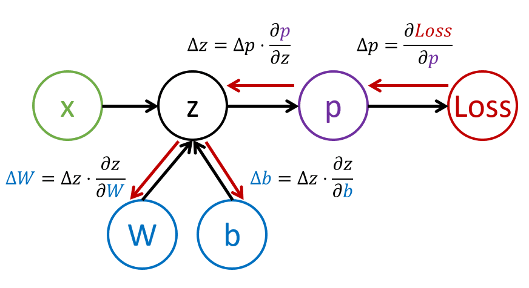

# 简介 - 神经网络. 多层感知器

在之前的部分中，您学习了最简单的神经网络模型 - 单层感知器，这是一个线性的二分类模型。

在本部分，我们将把这个模型扩展为一个更灵活的框架，使我们能够：

* 实现多类别分类，而不仅仅是二分类
* 解决回归问题，而不仅仅是分类问题
* 区分不是线性可分的类别我们还将开发自己的模块化框架，在Python中构建不同的神经网络架构。

## [预备讲座测验](https://red-field-0a6ddfd03.1.azurestaticapps.net/quiz/104)

## 机器学习的形式化

让我们开始形式化机器学习问题。假设我们有一个带有标签 **Y** 的训练数据集 **X**，我们需要构建一个模型 *f*，它可以做出最准确的预测。预测的质量通过损失函数 &lagran; 来衡量。常用的损失函数有:

* 对于回归问题，当我们需要预测一个数字时，我们可以使用 **绝对误差** &sum;i|f(x(i))-y(i)|，或者 **平方误差** &sum;i(f(x(i))-y(i))2
* 对于分类问题，我们使用 **0-1损失**（本质上与模型的 **准确率** 相同），或者 **逻辑损失**。对于一层感知机，函数*f*被定义为线性函数*f(x)=wx+b*（其中*w*是权重矩阵，*x*是输入特征向量，*b*是偏差向量）。对于不同的神经网络架构，这个函数可以具有更复杂的形式。

> 在分类问题中，通常希望将网络输出转换为对应类别的概率。为了将任意数值转换为概率（例如规范化输出），我们通常使用**softmax**函数 *σ*，而函数*f*变为*f(x)=σ(wx+b)*。

在上述*f*的定义中，*w*和*b*被称为**参数** *θ*=⟨*w, b*⟩。给定数据集⟨**X**, **Y**⟩，我们可以计算整个数据集上的整体错误作为参数*θ*的函数。

> ✅ **神经网络训练的目标是通过改变参数*θ*来最小化错误**

## 梯度下降优化算法有一种被称为梯度下降的函数优化方法。其思想是我们可以计算损失函数对参数的导数（在多维情况下称为梯度），并通过改变参数的方式使得误差减小。这可以形式化如下：

* 初始化参数为一些随机值 w(0)，b(0)
* 重复以下步骤多次：
    - w(i+1) = w(i)-&eta;&part;ℒ/∂w
    - b(i+1) = b(i)-&eta;&part;ℒ/∂b

在训练过程中，优化步骤应该考虑整个数据集（记住损失是通过所有训练样本的求和计算得到的）。然而，在现实生活中，我们会从数据集中取出称为**小批量**的小份数据，并基于其中的子集计算梯度。由于每次随机取出的子集不同，这种方法被称为**随机梯度下降**（SGD）。## 多层感知机和反向传播

如上所述，单层网络能够分类线性可分的类别。为了构建一个更丰富的模型，我们可以结合多层网络。数学上，这意味着函数*f*会有一个更复杂的形式，并且会在几个步骤中计算：
* z1=w1x+b1
* z2=w2&alpha;(z1)+b2
* f = &sigma;(z2)

在这里，&alpha;是一个非线性激活函数，&sigma;是一个softmax函数，参数&theta; = <*w1，b1，w2，b2*。

梯度下降算法仍然是一样的，但计算梯度会更加困难。根据链式求导法则，我们可以计算导数：* &part;&lagran;/&part;w2 = (&part;&lagran;/&part;&sigma;)(&part;&sigma;/&part;z2)(&part;z2/&part;w2)
* &part;&lagran;/&part;w1 = (&part;&lagran;/&part;&sigma;)(&part;&sigma;/&part;z2)(&part;z2/&part;&alpha;)(&part;&alpha;/&part;z1)(&part;z1/&part;w1)

> ✅链式求导法则用于计算损失函数相对于参数的导数。

请注意，所有这些表达式的最左边部分是相同的，因此我们可以通过从损失函数开始并“反向”通过计算图来有效地计算导数。因此，训练多层感知机的方法称为**反向传播**或'backprop'。

> TODO：图像引用

> ✅ 我们将在我们的笔记本示例中详细介绍反向传播。

## 结论

在这节课中，我们构建了自己的神经网络库，并将其用于一个简单的二维分类任务。

## 🚀 挑战在附带的笔记本中，您将实现自己的框架来构建和训练多层感知器。您将能够详细了解现代神经网络的运作方式。

请转到[OwnFramework](OwnFramework.ipynb)笔记本，并开始进行相关工作。

## [讲座后的测验](https://red-field-0a6ddfd03.1.azurestaticapps.net/quiz/204)

## 复习与自学

反向传播是人工智能和机器学习中常用的算法，值得更详细地学习。请参考[维基百科](https://wikipedia.org/wiki/Backpropagation)。## [实验](lab/README.md)

在这个实验中，你被要求使用你在本课中构建的框架来解决MNIST手写数字分类问题。

* [操作说明](lab/README.md)
* [笔记本](lab/MyFW_MNIST.ipynb)