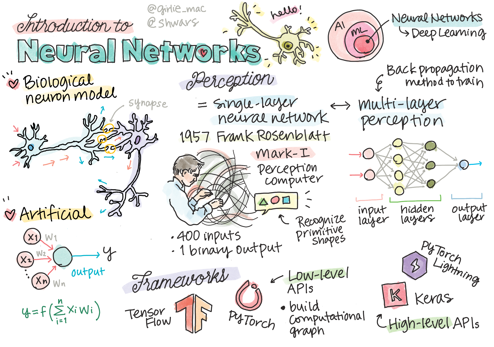

# Sinir Ağlarına Giriş

Giriş bölümünde tartıştığımız gibi, zekaya ulaşmanın yollarından biri bir **bilgisayar modeli** veya bir **yapay beyin** eğitmektir. 20. yüzyılın ortalarından beri, araştırmacılar farklı matematiksel modeller denediler, son yıllara kadar bu yön oldukça başarılı oldu. Beynin bu tür matematiksel modellerine **sinir ağları** denir.

> Bazen sinir ağları, gerçek nöron ağlarından değil, modellerden bahsettiğimizi vurgulamak için *Yapay Sinir Ağları*, YSA olarak adlandırılır.

## Makine Öğrenmesi

Sinir Ağları, amacı sorunları çözebilen bilgisayar modellerini eğitmek için verileri kullanmak olan **Makine Öğrenmesi** adlı daha büyük bir disiplinin parçasıdır. Makine Öğrenmesi, Yapay Zekanın büyük bir bölümünü oluşturur, ancak bu müfredatta klasik MÖ'yi ele almıyoruz.

> Klasik Makine Öğrenmesi hakkında daha fazla bilgi edinmek için ayrı **[Yeni Başlayanlar için Makine Öğrenmesi](http://github.com/microsoft/ml-for-beginners)** müfredatımızı ziyaret edin.

Makine Öğrenmesinde, **X** örneklerinden oluşan bir veri kümemiz ve bunlara karşılık gelen **Y** çıktı değerlerine sahip olduğumuzu varsayıyoruz. Örnekler genellikle **öznitelikler** içeren N boyutlu vektörlerdir ve çıktılara **etiketler** denir.

En yaygın iki makine öğrenmesi sorununu ele alacağız:

* **Sınıflandırma**, bir girdi nesnesini iki veya daha fazla sınıfa ayırmamızı gerektirir.
* **Bağlanım**, girdi örneklerinin her biri için bir sayı tahmin etmemizi gerektirir.

> Girdileri ve çıktıları tensörler olarak temsil ederken, girdi veri kümesi M&times;N boyutunda bir matristir; burada M, örnek sayısı ve N, öznitelik sayısıdır. Çıktı etiketleri Y, M boyutlu bir vektördür.

Bu müfredatta sadece sinir ağı modellerine odaklanacağız.

## Bir Sinir Modeli

Biyolojiden, beynimizin, her biri birden fazla "girdi" (akson) ve bir çıktı (dendrit) içeren sinir hücrelerinden oluştuğunu biliyoruz. Aksonlar ve dendritler elektrik sinyallerini iletebilir ve aksonlar ve dendritler arasındaki bağlantılar farklı derecelerde iletkenlik sergileyebilir (nöromediatörler tarafından kontrol edilirler).

 | 
----|----
Gerçek Sinir *([İmge](https://en.wikipedia.org/wiki/Synapse#/media/File:SynapseSchematic_lines.svg) Wikipedia'dan)* | Yapay Sinir *(İmge sahibi Yazar)*

Böylece, bir nöronun en basit matematiksel modeli birkaç X girdisi 1, ..., XN ve bir Y çıktısı ve bir dizi W ağırlığı içerir 1, ..., WN. Çıktı şöyle hesaplanır:

burada f bir doğrusal olmayan **etkinleştirme işlevi**dir.

> Sinirin ilk modelleri, 1943'te Warren McCullock ve Walter Pitts tarafından yazılan [Sinir aktivitesinin özünde olan fikirlerin mantıksal bir hesabı](http://www.springerlink.com/content/61446605110620kg/fulltext.pdf) adlı klasik makalede tanımlanmıştır. Donald Hebb, "[Davranışın Organizasyonu: Bir Nöropsikolojik Teori](https://books.google.com/books?id=VNetYrB8EBoC)" adlı kitabında bu ağları eğitebilmenin yolunu önerdi.

## Bu Bölümdekiler

Bu bölümde şunları öğreneceğiz:
* [Algılayıcı](03-Perceptron/translations/README.tr.md), iki sınıflı sınıflandırma için en eski sinir ağı modellerinden biridir
* [Çok katmanlı ağlar](04-OwnFramework/translations/README.tr.md) eşleştirilmiş bir not defteri ile [kendi çerçevemizi nasıl oluştururuz](04-OwnFramework/translations/OwnFramework.tr.ipynb)
* [Sinir ağları çerçeveleri](05-Frameworks/translations/README.tr.md), şu not defterleriyle birlikte: [PyTorch](05-Frameworks/translations/IntroPyTorch.tr.ipynb) ve [Keras/Tensorflow](05-Frameworks/translations/IntroKerasTF.tr.ipynb)
* [Aşırı öğrenme](05-Frameworks/translations/Overfitting.tr.md)