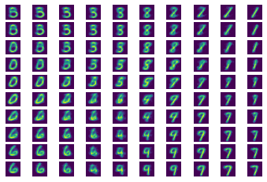
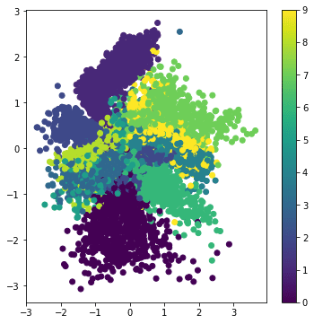

# 自编码器

在训练卷积神经网络时，一个问题是我们需要大量的标记数据。在图像分类的情况下，我们需要将图像分为不同的类别，这是一项人工努力。

## [预备课问答](https://red-field-0a6ddfd03.1.azurestaticapps.net/quiz/109)

然而，我们可能希望使用原始（未标记）数据来训练CNN特征提取器，这被称为**自监督学习**。我们将使用训练图像作为网络的输入和输出，而不是标签。**自编码器**的主要思想是我们将有一个**编码器网络**，它将输入图像转换为某个**潜空间**（通常只是一些较小大小的向量），然后有一个**解码器网络**，其目标是重构原始图像。

> ✅ 一个[自编码器](https://wikipedia.org/wiki/Autoencoder)是“用于学习未标记数据的有效编码的一种人工神经网络类型。”由于我们正在训练一个自编码器来捕捉尽可能多的原始图像信息以便进行准确的重建，网络试图找到最佳的**嵌入**，以捕捉意义。

> 图片来源：[Keras 博客](https://blog.keras.io/building-autoencoders-in-keras.html)

## 自编码器的使用场景

尽管重建原始图像本身似乎没有用处，但自编码器在以下几种情况下特别有用：* **降低图像维度以进行可视化**或**训练图像嵌入**。通常，自动编码器比PCA取得更好的结果，因为它考虑到图像的空间特性和分层特征。
* **去噪**，即从图像中去除噪音。因为噪音携带了大量无用的信息，自动编码器无法将所有信息都放入相对较小的潜在空间中，因此它只捕捉图像的重要部分。在训练去噪器时，我们从原始图像开始，使用人为添加噪音的图像作为自动编码器的输入。
* **超分辨率**，增加图像的分辨率。我们从高分辨率图像开始，并使用分辨率较低的图像作为自动编码器的输入。
* **生成模型**。一旦我们训练了自动编码器，解码器部分可以用来从随机潜在向量开始创建新对象。

## 变分自动编码器 (VAE)

传统自动编码器以某种方式降低输入数据的维度，找出输入图像的重要特征。然而，潜在向量通常没有太多意义。换句话说，以MNIST数据集为例，弄清不同潜在向量对应的数字并不容易，因为接近的潜在向量并不一定对应相同的数字。

另一方面，为了训练*生成*模型，对潜在空间有一定的理解会更好。这个想法引出了**变分自动编码器**(VAE)。VAE是一种自编码器，它学习预测潜在参数的**统计分布**，也称为**潜在分布**。例如，我们希望潜在向量按照一定的均值zmean和标准差zsigma（均值和标准差都是某个维度d的向量）进行正态分布。VAE的编码器学习预测这些参数，然后解码器使用这个分布中的随机向量对对象进行重构。

总结一下：

 * 从输入向量中，我们预测`z_mean`和`z_log_sigma`（不是直接预测标准差本身，而是预测它的对数）
 * 我们从分布N(zmean,exp(zlog_sigma))中采样一个向量`sample`
 * 解码器试图使用`sample`作为输入向量对原始图像进行解码

> 图片来源于Isaak Dykeman的[这篇博客文章](https://ijdykeman.github.io/ml/2016/12/21/cvae.html)

变分自编码器使用了一个由两部分组成的复杂损失函数：

* **重构损失** 是指重构图像与目标图像的相似度的损失函数（可以是均方差，或者MSE）。这与普通自编码器中使用的损失函数相同。
* **KL损失** 用于确保潜变量分布与正态分布保持接近。它基于[Kullback-Leibler散度](https://www.countbayesie.com/blog/2017/5/9/kullback-leibler-divergence-explained)的概念，这是一种估计两个统计分布相似度的度量标准。

VAE的一个重要优势是它能够相对容易地生成新的图像，因为我们知道从哪个分布采样潜向量。例如，如果我们在MNIST上用2D潜向量训练了VAE，我们可以在潜向量的不同分量上变化，生成不同的数字。

> 图片来自[Dmitry Soshnikov](http://soshnikov.com)

观察图像如何在不同部分的潜在参数空间中混合。我们也可以在2D中对这个空间进行可视化：

> 图片来自[Dmitry Soshnikov](http://soshnikov.com)## ✍️ 练习：自编码器

在对应的笔记本上进一步了解自编码器：

* [TensorFlow中的自编码器](AutoencodersTF.ipynb)
* [PyTorch中的自编码器](AutoEncodersPyTorch.ipynb)

## 自编码器的特性

* **数据专用** - 它们只能很好地处理它们训练过的图像类型。例如，如果我们在花朵上训练了一个超分辨率网络，那么它在肖像上的表现就不会很好。这是因为网络可以通过从训练数据集中学习到的特征细节来生成更高分辨率的图像。* **有损压缩** - 重建的图像与原始图像不相同。损失的本质由训练期间使用的*损失函数*定义
* 适用于**无标签数据**

## [讲座后测验](https://red-field-0a6ddfd03.1.azurestaticapps.net/quiz/209)

## 结论

在本课程中，您学习了AI科学家可用的各种类型的自动编码器。您学会了如何构建它们，以及如何使用它们来重建图像。您还了解了VAE以及如何使用它生成新图像。

## 🚀 挑战在本课中，你学习了如何使用自编码器处理图像。但是自编码器也可以用于处理音乐！你可以查看Magenta项目的[MusicVAE](https://magenta.tensorflow.org/music-vae)项目，该项目使用自编码器来学习重构音乐。通过使用这个库做一些[实验](https://colab.research.google.com/github/magenta/magenta-demos/blob/master/colab-notebooks/Multitrack_MusicVAE.ipynb)，看看你能创造出什么。

## [讲后测验](https://red-field-0a6ddfd03.1.azurestaticapps.net/quiz/208)

## 复习与自学

参考以下资源，了解更多关于自编码器的内容：

* [在Keras中构建自编码器](https://blog.keras.io/building-autoencoders-in-keras.html)* [关于NeuroHive的博文](https://neurohive.io/ru/osnovy-data-science/variacionnyj-avtojenkoder-vae/)
* [解释了变分自编码器](https://kvfrans.com/variational-autoencoders-explained/)
* [条件变分自编码器](https://ijdykeman.github.io/ml/2016/12/21/cvae.html)

## 作业

在[这个使用TensorFlow的笔记本](AutoencodersTF.ipynb)的末尾，你会找到一个"task" - 请将它作为你的作业。